## Calculating Load Summary with SPEL data in Excel 365

Perform load summary calculation using Excel 365. All calculations are performed with custom formula within Excel tables. These custom formula are listed in [LoadSumV2_LAMBDA.txt](./LoadSumV2_LAMBDA.txt). In Excel, use the **"Excel Labs"** add-in to manage these custom formula.

## Data from SPEL

The following data are retrieved from SPEL database into Excel as tables using PowerQuery:

- PowerQuery

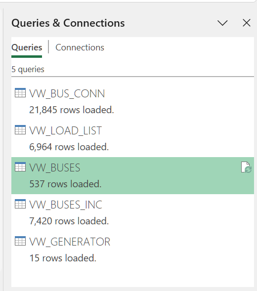

- VW_BUS_CONN : power system connectivity

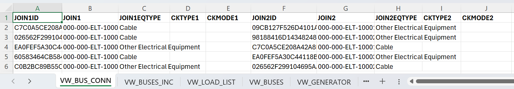

- VW_BUSES_INC : bus circuits and their switching states (Connected / Disconnected)

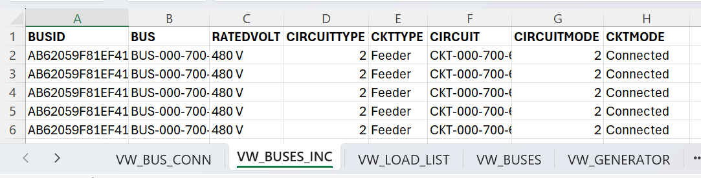

- VW_LOAD_LIST : electrical loads

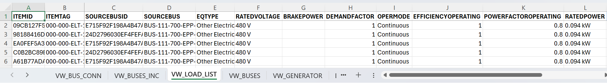

- VW_BUSES : buses

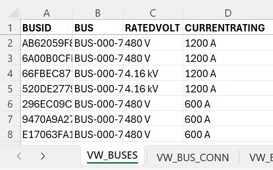

- VW_GENERATOR : generators

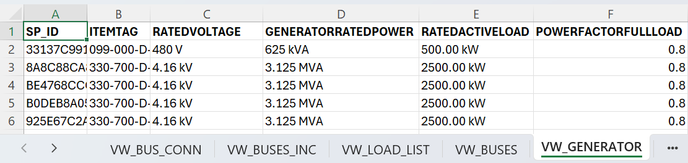

## Calculate normal operating values for each load

<pre>
- CoinFact =EL.fxCoinFact([@OPERMODE],1,0.5,0,0)
- MaxKVA =EL.fxRatedKVA([@RATEDPOWER],[@POWERFACTOROPERATING],[@EFFICIENCYOPERATING])
- OperKW =EL.fxOperKW([@MaxKVA],[@POWERFACTOROPERATING],[@DEMANDFACTOR],[@CoinFact])
- OperKVAR =EL.fxOperKVAR([@MaxKVA],[@POWERFACTOROPERATING],[@DEMANDFACTOR],[@CoinFact])
- OperKVA =EL.fxCalcKVA([@OperKW],[@OperKVAR])
</pre>

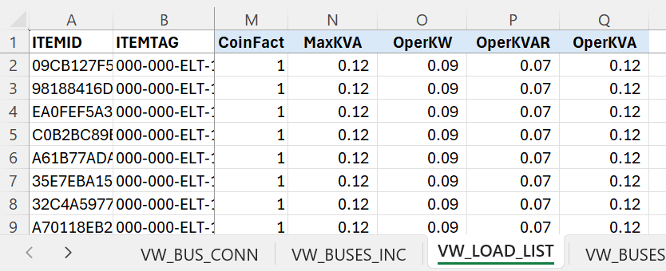

## Calculate total connected load for each bus

<pre>
- SrcBus =EL.fxSrcBus([@BUSID],VW_BUS_CONN)
- LoadCnt =EL.fxFilterCount([@BUSID],VW_LOAD_LIST[ITEMID],VW_LOAD_LIST[SOURCEBUSID],"")
- ConMaxKVA =EL.fxFilterSum([@BUSID],VW_LOAD_LIST[MaxKVA],VW_LOAD_LIST[SOURCEBUSID],"")
- ConKW =EL.fxFilterSum([@BUSID],VW_LOAD_LIST[OperKW],VW_LOAD_LIST[SOURCEBUSID],"")
- ConKVAR =EL.fxFilterSum([@BUSID],VW_LOAD_LIST[OperKVAR],VW_LOAD_LIST[SOURCEBUSID],"")
- ConKVA =EL.fxFilterSum([@BUSID],VW_LOAD_LIST[OperKVA],VW_LOAD_LIST[SOURCEBUSID],"")

</pre>

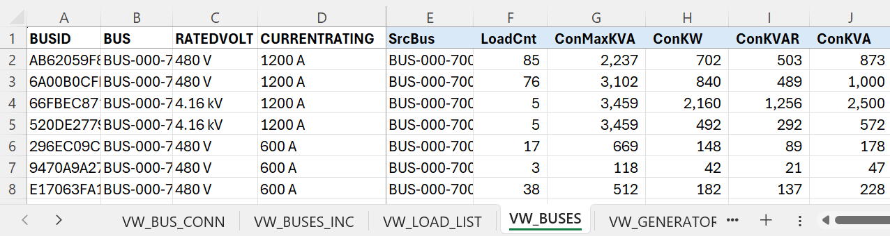

## Calculate downstream roll-up load for each bus

*BusRollupPath* is a delimited text of all the parent buses.

<pre>
- BusRollupPath =EL.fxBusRollup([@BUS],[BUS],[SrcBus])
- RollupKW =EL.fxSumValByPath([@BUS],[ConKW],[BusRollupPath])
- RollupKVAR =EL.fxSumValByPath([@BUS],[ConKVAR],[BusRollupPath])
- RollupKVA =EL.fxCalcKVA([@RollupKW],[@RollupKVAR])
</pre>

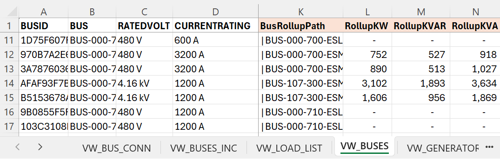

## Calculate total operating load for each bus

<pre>
- OperKW =[@ConKW]+[@RollupKW]
- OperKVAR =[@ConKVAR]+[@RollupKVAR]
- OperKVA =EL.fxCalcKVA([@OperKW],[@OperKVAR])
- OperPF =EL.fxCalcPF([@OperKW],[@OperKVA])
- OperVolt =EL.fxToVolt([@RATEDVOLT])
- OperAmp =EL.fxCalcAmp([@OperVolt],[@OperKVA])
</pre>

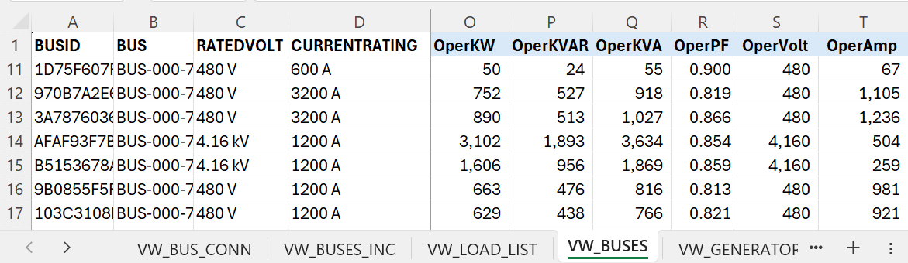

## Additional analysis of bus connectivity

SPEL load summary calculation assumes that the power system is a radial network, meaning that there is only one power source for each power component (bus, load, etc.) However, it is possible to model the power system in SPEL to have more than one power sources (ex. multiple incoming circuits on a bus.) When components have more than one power sources, then the result of the load summary calculation can be unexpected.

The calculation below analyze the number of sources for each bus.

- SrcCkt : count of source circuits
- SrcConn : count of connected source circuits
- SrcBusPath : delimited text of all the components between load and source buses.
- Disconn: flag if there are disconnected circuits in *SrcBusPath* or the bus has no source bus.

Note, currently, the load summary calculation in this spreadsheet does not take into account multiple sources or disconnected circuit scenarios.

<pre>
- SrcCkt =EL.fxSourceCktCount([@BUSID], VW_BUSES_INC)
- SrcConn =EL.fxSourceCktCount([@BUSID],VW_BUSES_INC,"Connected")
- SrcBusPath =EL.fxSrcBusPath([@BUSID],VW_BUS_CONN)
- Disconn =ISNUMBER(SEARCH("|XXX|",[@SrcBusPath]))
</pre>

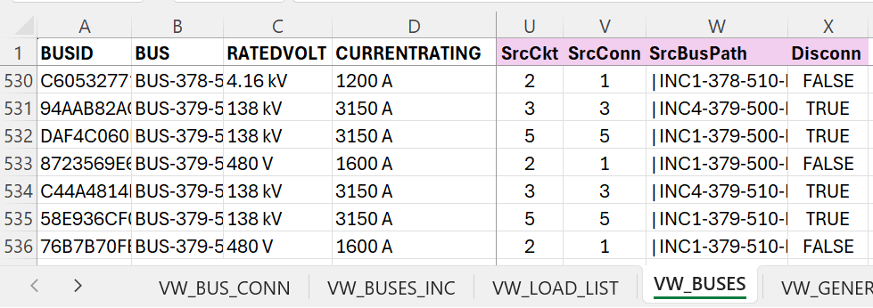