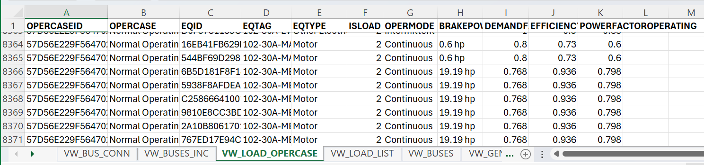
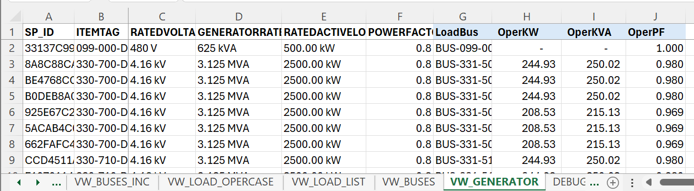

## Calculating Load Summary with SPEL data in Excel 365

Perform load summary calculation using Excel 365. All calculations are performed with custom formula within Excel tables. These custom formula are listed in [LoadSumV2_LAMBDA.txt](./LoadSumV2_LAMBDA.txt). In Excel, use the **"Excel Labs"** add-in to manage these custom formula.

The dataset from SPEL for use in this development is quite large. There are many formula calculations performed for large number of data rows and columns. To improve performance, the formula "_Calculation Option_" in Excel should be set to "_Manual_". But do remember to run "_Calculate Now_" or "_Calculate Sheet_" to see the latest result after any changes to the data.

The objective of this effort is to learn how to best design a set of non-trivial custom formula in Excel based on functional programming paradigm. Also at the same time, to develop a tool to aggregate, validate, and analyze electrical load data from SPEL.

## Data from SPEL

The following data are retrieved from SPEL database into Excel using PowerQuery:

_**<ins>PowerQuery</ins>**_ : Queries to retrieve data from SPEL database into Excel spreadsheets.


_**<ins>VW_BUS_CONN</ins>**_ : Power system connectivity spreadsheet.

Power flow from source to load in one direction. Connectivity data of power components are represented as follow:

- JOIN1ID is the source (from) power component
- JOIN2ID is the load (to) power component

It is expected that each power component (JOIN2ID) only have one source component (JOIN1D). Note, non-power components (which power does not flow through) are not stored in this table.


_**<ins>VW_BUSES_INC</ins>**_ : Bus circuits and their switching states (Connected / Disconnected) spreadsheet. It is important that the overall switching states of the circuits will result in a radial power distribution network.


_**<ins>VW_LOAD_LIST</ins>**_ : Electrical loads spreadsheet.

Note, SPEL maintains a separate set of these values for each load and for each operating case:
- OPERMODE
- BRAKEPOWER
- DEMANDFACTOR
- EFFICIENCYOPERATING
- POWERFACTOROPERATING


_**<ins>VW_LOAD_OPERCASE</ins>**_ : Load properties for each operating case (ex. Normal / Essential Operating Case).



_**<ins>VW_BUSES</ins>**_ : Buses spreadsheet. An objective of a load summary calculation is to determine the total loads supplied from a bus. Power components such buses, transformers, circuits, etc. will be sized based on the result of a load summary calculation. 


_**<ins>VW_GENERATOR</ins>**_ : Generator spreadsheet. The generator should be sized sufficiently to supply the connected load bus.


## Calculate values for each load

```
- CoinFact =EL.fxCoinFact([@OPERMODE],1,0.5,0,0)
- MaxKVA =EL.fxRatedKVA([@RATEDPOWER],[@POWERFACTOROPERATING],[@EFFICIENCYOPERATING])
- OperKW =EL.fxOperKW([@MaxKVA],[@POWERFACTOROPERATING],[@DEMANDFACTOR],[@CoinFact])
- OperKVAR =EL.fxOperKVAR([@MaxKVA],[@POWERFACTOROPERATING],[@DEMANDFACTOR],[@CoinFact])
- OperKVA =EL.fxCalcKVA([@OperKW],[@OperKVAR])
```


## Calculate total connected load for each bus

Connected loads are loads supplied directly from a bus instead of from other downstream buses. Downstream buses are buses supplied by this bus.

```
- SrcBus =EL.fxSrcBus([@BUSID],VW_BUS_CONN)
- LoadCnt =EL.fxFilterCount([@BUSID],VW_LOAD_LIST[ITEMID],VW_LOAD_LIST[SOURCEBUSID],"")
- ConMaxKVA =EL.fxFilterSum([@BUSID],VW_LOAD_LIST[MaxKVA],VW_LOAD_LIST[SOURCEBUSID],"")
- ConKW =EL.fxFilterSum([@BUSID],VW_LOAD_LIST[OperKW],VW_LOAD_LIST[SOURCEBUSID],"")
- ConKVAR =EL.fxFilterSum([@BUSID],VW_LOAD_LIST[OperKVAR],VW_LOAD_LIST[SOURCEBUSID],"")
- ConKVA =EL.fxFilterSum([@BUSID],VW_LOAD_LIST[OperKVA],VW_LOAD_LIST[SOURCEBUSID],"")
```


## Calculate downstream roll-up load for each bus

Roll-up loads are loads supplied from other downstream buses. *BusRollupPath* is a delimited text of all the parent / upstream buses of this bus.

```
- BusRollupPath =EL.fxBusRollup([@BUS],[BUS],[SrcBus])
- RollupKW =EL.fxSumValByPath([@BUS],[ConKW],[BusRollupPath])
- RollupKVAR =EL.fxSumValByPath([@BUS],[ConKVAR],[BusRollupPath])
- RollupKVA =EL.fxCalcKVA([@RollupKW],[@RollupKVAR])
```


## Calculate total operating load for each bus

The total loads supplied from a bus are the combine of connected loads and downstream roll-up loads.

```
- OperKW =[@ConKW]+[@RollupKW]
- OperKVAR =[@ConKVAR]+[@RollupKVAR]
- OperKVA =EL.fxCalcKVA([@OperKW],[@OperKVAR])
- OperPF =EL.fxCalcPF([@OperKW],[@OperKVA])
- OperVolt =EL.fxToVolt([@RATEDVOLT])
- OperAmp =EL.fxCalcAmp([@OperVolt],[@OperKVA])
```


## Calculate load bus for each generator

```
- LoadBus =EL.fxLoadBus([@[SP_ID]],VW_BUS_CONN)
- OperKW =EL.fxFilterData([@LoadBus],VW_BUSES[OperKW],VW_BUSES[BUS],"")
- OperKVA =EL.fxFilterData([@LoadBus],VW_BUSES[OperKVA],VW_BUSES[BUS],"")
- OperPF =EL.fxFilterData([@LoadBus],VW_BUSES[OperPF],VW_BUSES[BUS],"")
```



## Additional analysis of bus connectivity

SPEL load summary calculation assumes that the power system is a radial network, meaning that there is only one power source for each power component (bus, load, etc.) However, it is possible to model the power system in SPEL to have more than one power sources (ex. multiple incoming circuits on a bus.) When components have more than one power sources, then the result of the load summary calculation can be unexpected.

The calculation below analyze the number of sources for each bus.

- SrcCkt : count of source circuits
- SrcConn : count of connected source circuits
- SrcBusPath : delimited text of all the components between load and source buses.
- Disconn: flag if there are disconnected circuits in *SrcBusPath* or the bus has no source bus.

Note, currently, the load summary calculation in this spreadsheet does not take into account multiple sources or disconnected circuit scenarios.

```
- SrcCkt =EL.fxSourceCktCount([@BUSID], VW_BUSES_INC)
- SrcConn =EL.fxSourceCktCount([@BUSID],VW_BUSES_INC,"Connected")
- SrcBusPath =EL.fxSrcBusPath([@BUSID],VW_BUS_CONN)
- Disconn =ISNUMBER(SEARCH("|XXX|",[@SrcBusPath]))
```

